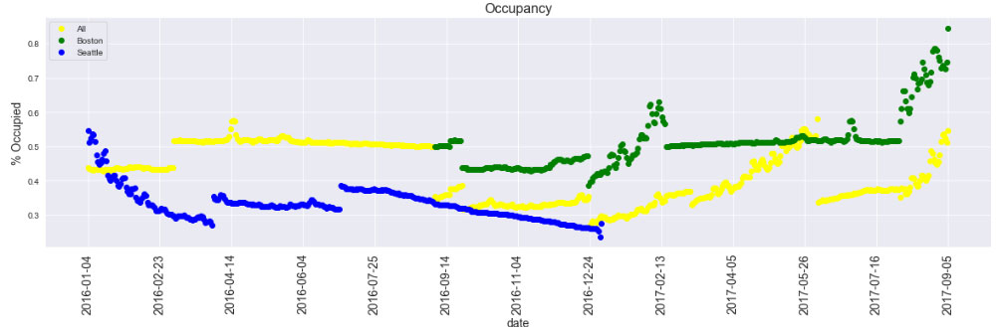
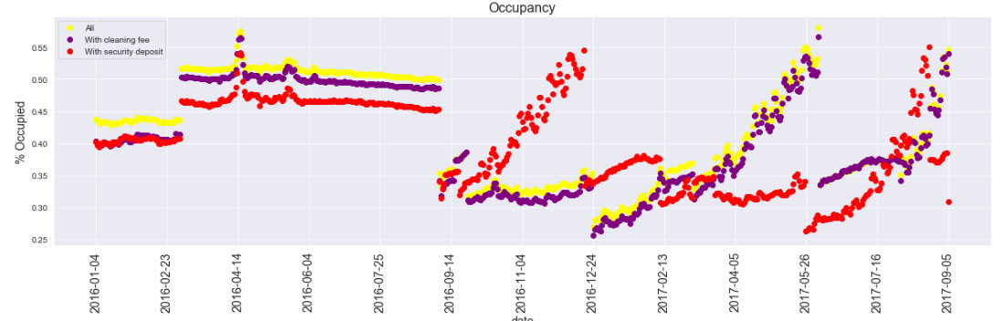

<i>Art credit: https://www.theguardian.com/travel/2016/feb/10/van-gogh-your-airbnb-host-art-institute-of-chicago</i>
<H2>What drives you to book at Airbnb?</h2>
A data based look at Seattle and Boston's Airbnb data from 2016 and 2017  

<b>Introduction</b> 
Airbnb is known for being the largest non-land owning hospitality brand in the world, but it needs more than a catchy name, and different style to drive business. 
Having never studied this company's data before, I thought we would cover a few basic bases first.  
We only used Boston and Seattle's listing and calendar data from 2016 and 2017, but if you're an aspiring data scientist, data artist, or other data type person, you could gather more here: http://insideairbnb.com/get-the-data.html  
Our dataset included 7320 listings, 12378 beds, and 1 treehouse, with availability listings from 2016-01-04 to 2017-09-05

<b>Part I: Does Airbnb have seasonality to their occupancy?</b>
Many industries will suffer from a downturn during the cold months, and a swelling of profits during the summer. Does Airbnb buck this trend with it's innovative approach to room rentals?

Although Boston and Seattle do not share the exact same occupancy rate, we can see n overall downward trend starting mid-september, and continuing until late december, then slowly rising towards mid-year 

<b>Part II: What are the major influences on room pricing?</b> 
The following graph uses this as a comparison:
* an entire apartment with a real bed, moderate cancellation policy, hosted by a superhost, and is not instantly bookable
* The guest does not require a license, or phone verification

Keep in mind that correlation does not mean causation. Rentals with a strict cancellation policy tend to charge over $100 more than those with a moderate one, not that having such a policy drives the price up.  
Most of these correlations make sense though, like how renting a dorm room would be cheaper than an entire apartment for example.

<b>Part III: Does having a cleaning fee or security deposit affect your occupancy?</b> 
Here we are circling back to look at occupancy rates, this time though, we will review the overall trends beside those with cleaning fees and security deposits. Does having these make your rental less bookable?

<b>Conclusion</b> 
In this article, we dove into Boston and Seattle Airbnb data from 2016 and 2017.
1. We took a look at occupancy rates over time, which showed a downturn in stays during the winter months
2. We analyzed what characteristics of a rental are correlated to price, and in what direction. The evidence shows that room type, property type, number of bathrooms, and possibly the cancellation policy have strong influence over pricing.
3. We studied how cleaning fees and security deposits can have a negative impact on stays, except with a suprising turn during the low season, where rentals with security deposits experience a boon

<h3>What will you book with Airbnb?</h3>

